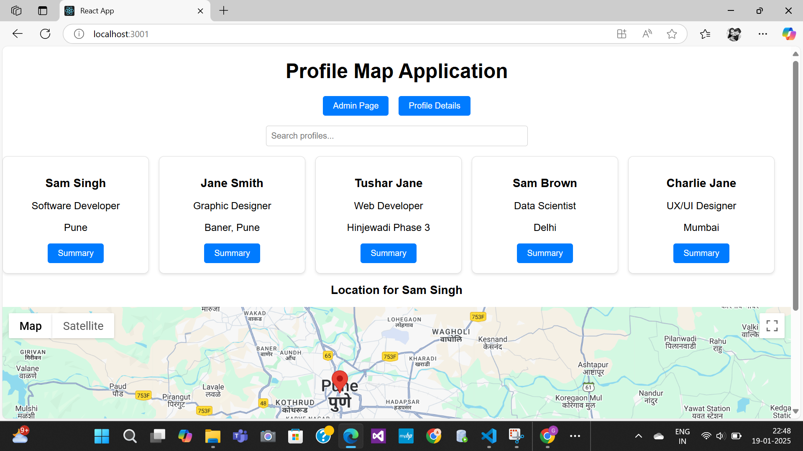

# Profile Map Application

## Overview
This web-based **Profile Map Application** allows users to view a collection of profiles, search for specific profiles, and interactively explore the geographic locations associated with each profile. The application dynamically displays the addresses on a map, providing an intuitive and engaging user experience.

## Features
- **Profile Display**: Displays a list of profiles with essential information, such as name, description, and geographic location.
- **Interactive Mapping**: Displays the location of each profile on an interactive map using Google Maps or other map services.
- **Search Functionality**: Allows users to search profiles based on name.
- **Summary Button**: Click on a "Summary" button to view the profile’s location on the map.
- **Responsive Design**: The application is mobile-friendly, ensuring a smooth user experience on different devices.
- **Profile Details Page**: Allows users to view more in-depth details about a specific profile.
- **Admin Page**: An admin panel to manage profiles (add, edit, delete).

## How to Use
1. **View Profiles**: When you open the application, you will see a list of profiles with their names, descriptions, and "Summary" buttons.
2. **Search Profiles**: Type a name into the search bar to filter profiles.
3. **View Location**: Click on the "Summary" button next to any profile to see its geographic location on the map.
4. **Navigate Admin Page**: Access the Admin Page to manage profile data.
5. **Mobile Support**: The application is responsive and works well on smartphones and tablets.

## Installation
1. Clone the repository to your local machine:
   ```bash
   git clone https://github.com/GauriAyalane18/profile-map-app.git

## Technologies Used
- **React**: Framework for building the user interface.
- **React Router**: To handle navigation between pages.
- **Google Maps API**:  To integrate the map functionality and display profile locations.
- **CSS/Styled Components**:  For styling the application.
- **LocalStorage**:  To store and persist search queries or profile data.

## Files
- **App.js**: Main React component that handles routing and layout.
- **ProfileCard.js**: Component for displaying individual profile information.
- **MapComponent.js**: Displays the interactive map with location markers.
- **HomePage.js**: Displays the list of profiles and search functionality.
- **ProfileDetailsPage.js**: Displays detailed information for a single profile.
- **AdminPage.js**: Manages profile data (add, edit, delete).
- **mockData/profiles.json**: Contains mock profile data used in the app.
- **styles/styles.css**: Contains custom styling for the application.

## Preview
 
(preview2.png) 
(preview3.png) 


## Author 
  GitHub: [@GauriAyalane18](https://github.com/GauriAyalane18)